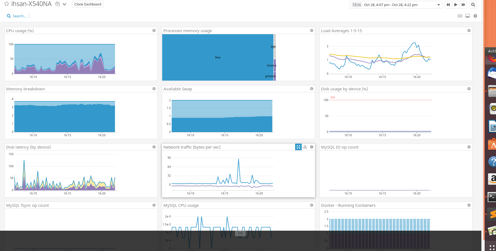
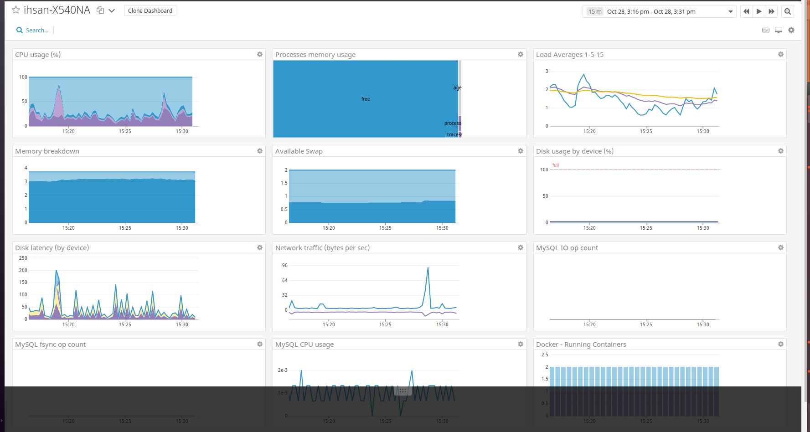

## Setting up the Environment 

I am using Linux Ubuntu 18.04. 

First steps, download Vagrant and Docker. 

Once Vagrant is downloaded, provision the VM using the commands in the notes.txt file, then use the Vagrant file to configure the VM as desired. 

In order to the docker agent in the database (I used mysql for docker), run the shell script in the provision.sh file, using your own API key. Please note, that running mysql v7.0 seems to cause issues when using datadog and can't communicate the metrics back - a workaround is to use mysql v5.7.

Here's the running host map and database


 
 
 

The custom agent check is located in the metrics_example.py file, within the datadog-agent-check folder. 

In order to do this, I ran python locally (not in Docker) and installed datadog via this script

```
pip3 install datadog
```

The python code to create same is found within, as well as commented examples of other metrics one might wish to use. 

Here is what I used below

```import random

from datadog_checks.base import AgentCheck

__version__ = "1.0.0"

class MyClass(AgentCheck):
    def check(self, instance):
        self.gauge(
            "my_metric",
            random.randint(0, 1000),
            tags="metric_submission_type:gauge",
        )
``` 
        
### To edit the collection interval, change the .yaml file to the desired interval - I would recommend doing this in any event as it abstracts the interval from your code base.


I have skipped the section on configuring the specific dashboard based on time constraints - I had to teach myself how to use Docker during this exercise hence the lack of time :(. 

I ran the given flask, app to use the APM tracing agent. First, ensure you've installed flask (and of course Python) on the environment in which you'll run the app - I used my local Linux Ubuntu 18.04 machine. 

Before you do this, make sure to install datadog and ddtrace too - again within the same environment in which you'll run the app. 

#### Here's the running flask app in datadog. 

https://raw.githubusercontent.com/ihsanfullstack/hiring-engineers/master/flaskapp.png

### Difference between a service and a resource

A service is an application / piece of software from a holistic perspective. For example, in micro-service architecture, each micro service is a service responsible for a given part of the overall architecture/service. A resource however in this context would be an API endpoint within one of the services which could be responsible for serving a view/table of a database. All the API endpoints that one service is responsible for are examples of resources. 


### Anything creative I'd use Datadog for? 

Yes, by all means. I'd personally use Datadog to monitor a smart home system at scale, to help me understand where the majority of power usage is coming from. For example, if I were to divide my smart home into a micro-service architecture, and logically seperate each micro-service into relevant concerns (such as bathroom, kitchen, dining room) I could use the data dog agent on each service to determine where most services are employed and at what specific times. If I were to think of this in a commercial sense then, we could analyse a huge amount of data from smart homes in this fashion, to determine where most energy is expended and where energy efficiency efforts (better bulbs, better times to use utilities, as electricity price varies) could be employed in order to maximise green living. Just a thought! 


