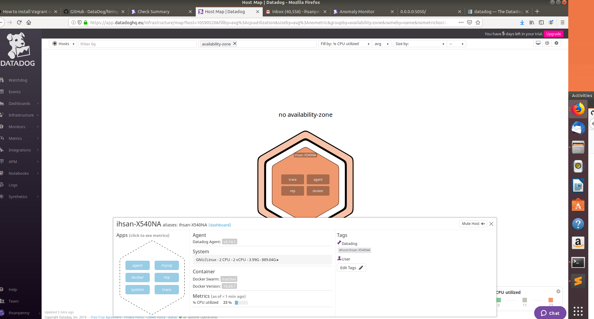
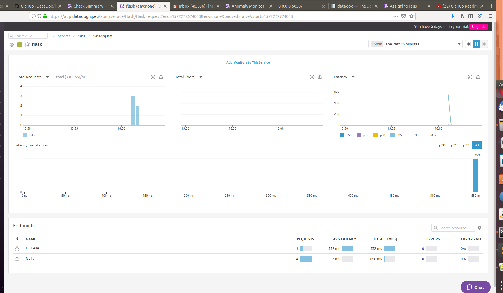

## Setting up the Environment 

I am using Linux Ubuntu 18.04 & Windows 10. Setting up Vagrant may not be necessary using Ubuntu only, as Docker can run on Linux without Vagrant. 

First steps, download Vagrant and Docker, for executing on Windows 10. 

Full instructions for doing this can be executed using the commands found in

*hiring-engineers/hiring-engineers/provision.sh*

& 

*hiring-engineers/hiring-engineers/install-docker.sh*

&& Please note that using Linux Ubuntu, one does not need to download Vagrant to run docker, although using Vagrant if you are using Linux, might help with portability of the end solution. 

Once Vagrant is downloaded, provision the VM using the commands in the notes.txt file, then use the Vagrant file *hiring-engineers/hiring-engineers/Vagrantfile* to configure the VM as needed to run this particular solution. 

In order to install the docker agent in the database (I used an image of mysql for docker), run the shell script in the provision.sh file, using your own API key. Please note, that running mysql v7.0 seems to cause issues and can't communicate with datadog and send the metrics back to datadog via the agent - a workaround is to use mysql v5.7.

For other integrations (like NoSQL, MongoDB etc.) utilise the integrations within datadog and change the script to install Datadog accordingly. 


Here's the running host map and database as seen in datadog


 
 
 
 
 
 ## Agent Check

The custom agent check I'm running is located in the metrics_example.py file, within the datadog-agent-check folder. 

In order to do this, I ran python locally (not in Docker) and installed datadog via this script. 

Be careful here, as *pip* is a Python command to manage dependencies, *pip3* is for Python 3, *pip2* is for Python 2 etc. 

```
pip3 install datadog
```

The python code to create same is found within, as well as commented examples of other metrics one might wish to use. 

Here is what I used below - very interestingly, installing the datadog agent for Python within a docker container on a Linux machine, will still allow communication with this app, running locally on my Ubuntu 18.04 machine - I thought this was really neat. We'll see later that the same applies for Flask. 

```import random

from datadog_checks.base import AgentCheck

__version__ = "1.0.0"

class MyClass(AgentCheck):
    def check(self, instance):
        self.gauge(
            "my_metric",
            random.randint(0, 1000),
            tags="metric_submission_type:gauge",
        )
``` 
        
## To edit the collection interval, change the .yaml file to the desired interval - I would recommend doing this in any event as it abstracts the interval from your code base.

```

instances:
  - min_collection_interval: 45
  
```

### APM Tracing

I ran the below flask app to use the APM tracing agent. 

```

import logging
import sys

# Get the Datadog agent’s ip address
# from datadog.dogstatsd import route
# hostname=route.get_default_route()
 
# Connect the APM to the agent
from ddtrace import tracer, patch_all
# tracer.configure(hostname=hostname)
 
# Activate the APM
patch_all()

from flask import Flask
# Have flask use stdout as the logger
main_logger = logging.getLogger()
main_logger.setLevel(logging.DEBUG)
c = logging.StreamHandler(sys.stdout)
formatter = logging.Formatter('%(asctime)s - %(name)s - %(levelname)s - %(message)s')
c.setFormatter(formatter)
main_logger.addHandler(c)

app = Flask(__name__)

@app.route('/')
def api_entry():
    return 'Entrypoint to the Application'

@app.route('/api/apm')
def apm_endpoint():
    return 'Getting APM Started'

@app.route('/api/trace')
def trace_endpoint():
    return 'Posting Traces'

if __name__ == '__main__':
    app.run(host='0.0.0.0', port='5050')
    
```

It is requisite to import ddtrace within this app, and invoke the *patch_all()* to connect to the APM agent - the APM agent needs to be installed of course, and once more you'll find the right APM agent within the Datadog APM library.

Ensure you've installed flask (and of course Python) on the environment in which you'll run the app - I used my local Linux Ubuntu 18.04 machine. 

Before you do this, make sure to install datadog and ddtrace too - again within the same environment in which you'll run the app. 

Once set up, simply run the flask app using the console, and it should begin tracing - maybe hit refresh a few times in your browser, this seemed to do the trick for me.

#### Here's the running flask app in datadog. 

 

### Difference between a service and a resource

A service is an application software artifact. For example, in a micro-service architecture, each sub-service is a service responsible for a given part of the overall application, perhaps one service is responsible for the user reviews in an e-commerce site. A resource however, in this context, would be an API endpoint within one of the services which could be responsible for serving/updating/adding a view or table in a database; in fact getters and setters within a class would be resources. All the API endpoints that one service is responsible for are examples of resources. A resource is more like an object, whereas a service is more like the deployed architecture in which that object lives. In summary, a service is something that performs an overall job, whereas a resource is used by that service to perform a specific action. 


### Anything creative I'd use Datadog for? 

Yes, by all means. I'd personally use Datadog to monitor a smart home system at scale, to help me understand where the majority of power usage is coming from. For example, if I were to divide my smart home into a micro-service architecture, and logically seperate each micro-service into relevant concerns (such as bathroom, kitchen, dining room) I could use the data dog agent on each service to determine where most services are employed and at what specific times. If I were to think of this in a commercial sense then, we could analyse a huge amount of data from smart homes in this fashion, to determine where most energy is expended and where energy efficiency efforts (better bulbs, better times to use utilities, as electricity price varies) could be employed in order to maximise green living. Just a thought! 

The above is interesting - after I wrote it a couple of things jumped at me. Firstly, monitoring, independent of Datadog, is clearly better with loosely coupled, micro-service type architecture. Secondly, Datadog gets very interesting with IoT - and since we can customise any metric we like (as I've done above) we can actually use it as a central dashboard for any IoT suite/service that we'd like! 


